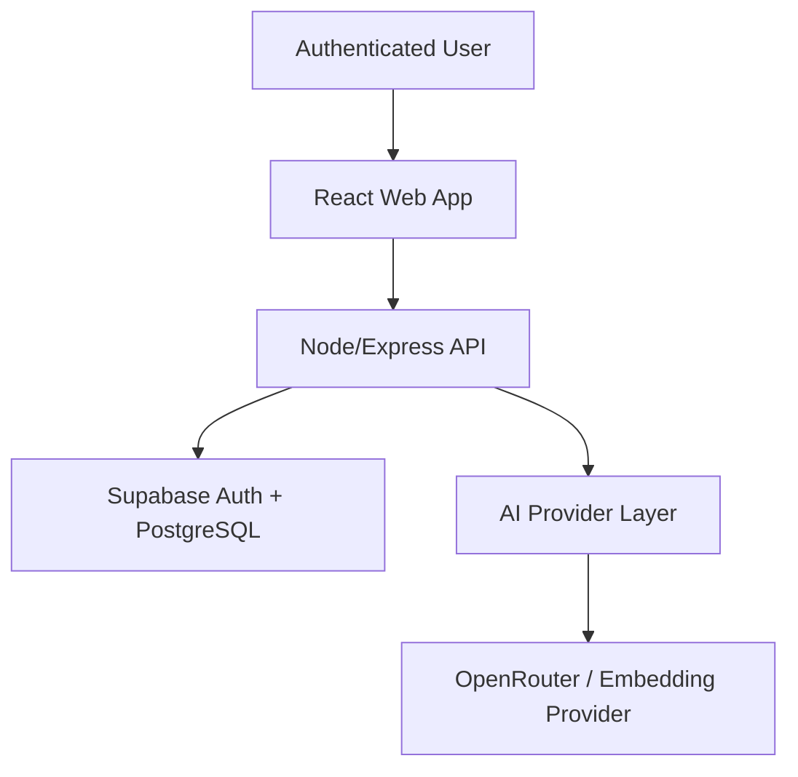
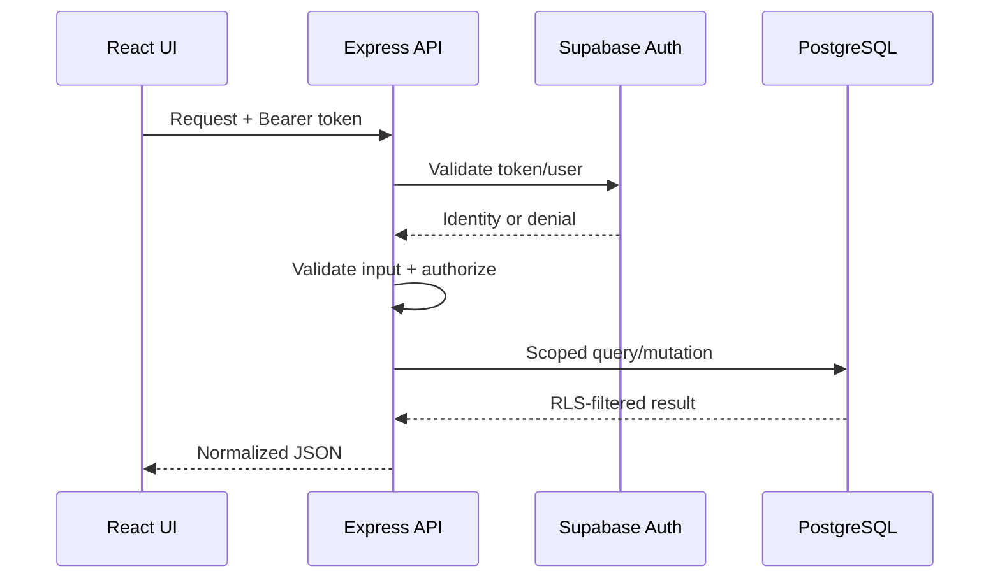
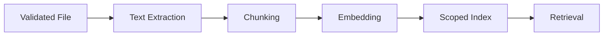

# System Architecture — BLACK FLASH ORBIT

## 1. Tujuan arsitektur

Arsitektur BLACK FLASH ORBIT harus mendukung modul AI dan intelligence yang berkembang tanpa menjadikan frontend, backend route, database, dan provider AI saling terikat secara rapuh.

Prinsip utama:

- Modular by domain.
- API-first antara frontend dan backend.
- Server-side secret dan authorization.
- Supabase RLS sebagai defense-in-depth.
- Provider AI dapat diganti melalui service layer.
- Degraded state lebih baik daripada data palsu.
- Mobile-first dan accessible.

## 2. System context



## 3. Runtime containers

| Container | Tanggung jawab |
| --- | --- |
| React Web | Navigation, forms, dashboards, client state, protected routes |
| Express API | Validation, auth, authorization, orchestration, safe errors |
| Supabase Auth | Identity dan access token |
| PostgreSQL | Persistent domain data dan RLS |
| AI Provider Layer | Prompt execution, model/provider normalization, timeout |
| Knowledge Engine | Parse, normalize, search, dan target embedding/indexing |
| Vercel/API Host | Build, hosting, routing, environment |

## 4. Frontend architecture

Lokasi utama: `apps/web/src`.

```text
src/
├── components/          # Shared dan Command Center components
├── context/             # Authentication/global contexts
├── data/                # Categories dan static domain configuration
├── features/            # Feature modules, termasuk knowledge
├── hooks/               # Reusable state and data hooks
├── lib/                 # Supabase dan auth recovery
├── pages/               # Route-level screens
├── services/            # API/provider-facing clients
├── App.jsx              # Routes dan top-level shell
├── index.css             # Global design system styles
└── main.jsx              # React entrypoint
```

### Routing rules

- Public-only: login dan register ketika belum authenticated.
- Protected: Command Center dan seluruh workspace privat.
- Admin-restricted: Security Center dan aksi administratif.
- Unknown route: safe not-found atau redirect yang tidak menimbulkan loop.

### State rules

- Server data diambil melalui services/hooks.
- UI-local state tetap berada pada component/feature terdekat.
- Auth session berasal dari Supabase Auth context.
- Jangan membuat source kebenaran session kedua di local storage.
- Mutation harus mencegah double-submit.

### API client rules

- Gunakan service layer existing.
- `getAuthenticatedHeaders()` menangani bearer token.
- Request memiliki timeout dan normalization.
- Local API fallback hanya berlaku pada hostname development.
- Response non-JSON harus menjadi error yang dapat dipahami.

## 5. Backend architecture

Lokasi utama: `server/`.

```text
server/
├── index.js             # Express bootstrap dan middleware order
├── lib/                 # Domain engines dan repositories
├── middleware/          # requireAuth, notFound, errorHandler
├── routes/              # HTTP contracts per domain
└── services/            # External provider and prompt services
```

### Request lifecycle



### Middleware order

Target order:

1. Trust proxy configuration bila dibutuhkan host.
2. Request ID.
3. Helmet.
4. CORS allowlist.
5. Compression.
6. Body size limits.
7. Request logging yang aman.
8. Rate limiting.
9. Public routes.
10. Domain routes dengan auth masing-masing.
11. Not found.
12. Central error handler.

## 6. Authentication dan authorization

### Authentication

- Browser menerima Supabase session.
- Frontend mengirim access token sebagai bearer token.
- Backend memverifikasi token dan user.
- Invalid/expired token menghasilkan 401.
- Unavailable auth provider menghasilkan degraded-safe response, bukan bypass.

### Authorization

- Role authorization dilakukan di backend.
- Data ownership dilakukan pada query dan RLS.
- UI permission hanya meningkatkan UX, bukan kontrol keamanan utama.
- Service-role access dibatasi ke server-side operations.

## 7. Domain modules

| Domain | Frontend | Backend |
| --- | --- | --- |
| Command Center | Dashboard dan panels | telemetry/runtime libraries dan v1 routes |
| AI Workspace | `AIWorkspace.jsx` | AI/chat routes, OpenRouter, memory |
| AI Newsroom | `AINewsroom.jsx` | newsroom route, prompt and evidence engines |
| Knowledge | feature components + service | knowledge route dan `orbitKnowledge` |
| Web Builder | `WebBuilder.jsx` | builder routes, schema, generation service |
| Automation | `WorkflowAutomation.jsx` | automation API/status |
| Security | `SecurityCenter.jsx` | security status dan auth middleware |
| Prompt Library | `PromptLibrary.jsx` | Supabase-backed prompt domain |

## 8. AI provider architecture

### Current

- OpenRouter menangani chat/generation.
- Model default session: `openrouter/auto`.
- Newsroom menggunakan server-side OpenRouter generation.
- Knowledge indexing menggunakan OpenAI embeddings melalui provider terpisah.
- Knowledge Copilot menggunakan OpenRouter untuk answer generation.
- OpenRouter key tidak pernah digunakan sebagai credential embedding.

### Target abstraction

```text
AI Request
→ Provider Resolver
→ Provider Adapter
→ Timeout/Retry/Abort
→ Normalized Result
→ Usage Metadata
```

Provider adapter tidak boleh mengubah domain contract. Error provider dinormalisasi menjadi code seperti:

- `AI_PROVIDER_NOT_CONFIGURED`
- `AI_PROVIDER_UNAVAILABLE`
- `AI_REQUEST_TIMEOUT`
- `AI_RATE_LIMITED`
- `AI_INVALID_RESPONSE`

Knowledge memisahkan dua capability:

```text
Document chunks → OpenAI embeddings → pgvector
Retrieved context → OpenRouter chat → cited answer
```

## 9. Knowledge architecture

### Current verified baseline

- File validation: `.txt`, `.md`, `.pdf`, `.docx`.
- Maksimum upload: 10 MB.
- Maximum extracted text: 240.000 karakter.
- Metadata disimpan pada `public.knowledge_documents`.
- Chunk dan embedding disimpan pada `public.knowledge_chunks`.
- Search menggunakan vector match dengan fallback keyword owner-scoped.
- Ownership menggunakan `owner_id = auth.uid()` dan filter server-side.

### Target RAG pipeline



Schema vector/chunk belum boleh dianggap final sebelum migration khusus tersedia. UI harus membedakan full-text knowledge dari vector-indexed knowledge.

## 10. Data architecture

- `auth.users` adalah sumber identity.
- Domain tables menggunakan `user_id` bila memungkinkan.
- Legacy/email ownership harus dimigrasikan secara aman, bukan dihapus langsung.
- JSONB digunakan untuk theme, settings, metadata, sections, dan SEO yang fleksibel.
- Foreign key dan RLS menjaga tenant isolation.
- Migration bersifat forward-only; rollback destruktif tidak otomatis.

## 11. Deployment architecture

### Local

```text
Vite :5173 → Express :5000 → Supabase / AI providers
```

### Production target

```text
Browser → Vercel/static frontend → API host/serverless routes
                                  → Supabase
                                  → AI providers
```

SPA fallback tidak boleh menangkap API route. API routing tidak boleh mengembalikan HTML untuk request JSON.

## 12. Observability

Minimum event fields:

- timestamp
- request ID
- environment
- route/method
- status code
- duration
- authenticated user ID hash/opaque ID bila diperlukan
- error code
- provider/model tanpa API key

Jangan log bearer token, cookies, service-role key, full document content, atau prompt sensitif penuh.

## 13. Technical debt register

| Item | Dampak | Target |
| --- | --- | --- |
| `App.jsx` masih besar | Sulit dipelihara | Ekstrak route/shell secara bertahap |
| Knowledge ownership berbasis email | Identity dapat berubah | Migration aman ke `user_id` |
| Knowledge prefix berpotensi tidak seragam | Client/server mismatch | Standardisasi versi API |
| Vector/chunk schema belum final | RAG belum lengkap | Migration dan provider abstraction |
| `master` tertinggal | Production drift | Release PR v0.8 |
