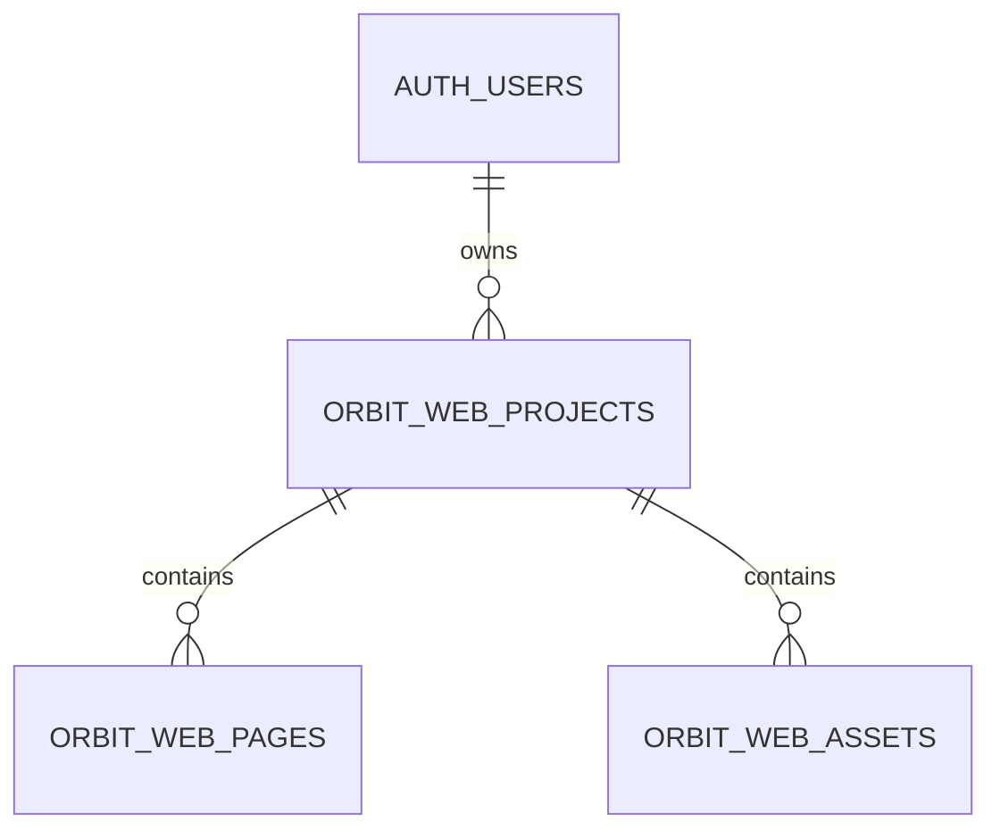
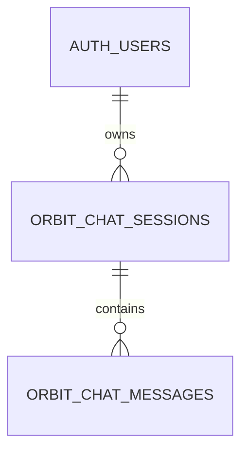

# Database Design — BLACK FLASH ORBIT

## 1. Platform

- PostgreSQL melalui Supabase.
- Identity melalui `auth.users`.
- UUID menggunakan `gen_random_uuid()`.
- RLS wajib untuk data pengguna.
- Migration berada di `supabase/migrations/`.

## 2. Table inventory terverifikasi

| Table | Fungsi | Ownership |
| --- | --- | --- |
| `public.orbit_knowledge` | Dokumen knowledge baseline | `user_email` + JWT email |
| `public.knowledge_documents` | Metadata dokumen RAG | `owner_id` |
| `public.knowledge_chunks` | Chunk dan vector embedding | `owner_id` + `document_id` |
| `public.orbit_prompts` | Prompt library | `user_id`, `created_by`, `user_email` |
| `public.orbit_prompt_categories` | Master kategori prompt | Policy existing harus diverifikasi |
| `public.orbit_web_projects` | Project Web Builder | `user_id` |
| `public.orbit_web_pages` | Page per project | `user_id` + composite project FK |
| `public.orbit_web_assets` | Asset per project | `user_id` + composite project FK |
| `public.orbit_chat_sessions` | AI chat session | User ownership |
| `public.orbit_chat_messages` | Message per session | Session/user ownership |

Chat tables sudah menjadi target migrasi aktif pada proyek; sebelum membuat migration baru, inspeksi schema terapan agar tidak menduplikasi kolom atau policy.

## 3. Knowledge baseline

`public.orbit_knowledge`:

| Column | Type | Aturan |
| --- | --- | --- |
| `id` | uuid | Primary key |
| `user_email` | text | Required ownership baseline |
| `title` | text | Required |
| `content` | text | Required, extracted/manual content |
| `source` | text | Default `manual` |
| `use_in_ai_context` | boolean | Default true |
| `metadata` | jsonb | Default object |
| `created_at` | timestamptz | Default now |
| `updated_at` | timestamptz | Trigger updated |

Indexes:

- User email.
- User + context-enabled.
- Trigram indexes pada title, source, content.

RLS menggunakan perbandingan `user_email` dengan email JWT.

### RAG v1

Migration `20260706010000_knowledge_rag_v1.sql` menambahkan:

- `public.knowledge_documents`
- `public.knowledge_chunks`
- bucket privat `knowledge-documents`
- RPC `public.match_knowledge_chunks`
- RLS CRUD berdasarkan `owner_id = auth.uid()`
- lifecycle `uploaded`, `indexing`, `indexed`, dan `failed`

`public.orbit_knowledge` tetap merupakan baseline legacy. Migrasi atau backfill data legacy harus dilakukan terpisah setelah data terverifikasi.

## 4. Prompt library

`public.orbit_prompts` memiliki:

- `user_id`, `user_email`, `created_by`
- `title`, `category`, `content`
- `is_favorite`, `is_pinned`
- `usage_count`, `last_used_at`
- timestamps

Constraints:

- Title 1–140 karakter.
- Content 1–12.000 karakter.
- Category lowercase slug.
- Usage count non-negative.

Search menggunakan `to_tsvector('simple', title + content + category)`.

## 5. Universal Web Builder

### Relationships

### `orbit_web_projects`

- Unique `(id, user_id)` untuk composite ownership FK.
- Unique `(user_id, slug)`.
- Status: `draft`, `exported`, `archived`.
- `theme`, `settings`, `metadata` wajib JSON object.

### `orbit_web_pages`

- Composite foreign key `(project_id, user_id)`.
- Unique `(project_id, path)`.
- `seo` dan `metadata` JSON object.
- `sections` JSON array.
- `sort_order >= 0`.

### `orbit_web_assets`

- Composite foreign key `(project_id, user_id)`.
- Asset type allowlist.
- Wajib memiliki `storage_path` atau `source_url`.
- Delete project melakukan cascade.

Semua tabel Web Builder memiliki RLS CRUD berdasarkan `auth.uid() = user_id`.

## 6. Chat data model

### Required invariants

- Session dimiliki satu authenticated user.
- Message wajib terkait session valid.
- User tidak dapat menambahkan message ke session user lain.
- Model session default `openrouter/auto`.
- Delete session menentukan cascade/soft-delete secara eksplisit.
- Urutan message stabil melalui timestamp dan tie-breaker ID/sequence.

### Conceptual relationship

## 7. Migration rules

1. Buat migration baru dengan timestamp/sequence unik.
2. Jangan edit migration yang sudah diterapkan.
3. Gunakan `if not exists` hanya bila tidak menyembunyikan schema mismatch.
4. Tambahkan constraints setelah data lama dibersihkan/backfill.
5. Buat index untuk foreign key dan query utama.
6. Aktifkan RLS dan policy sebelum tabel digunakan production.
7. Uji migration pada database non-production.
8. Backup sebelum migration berisiko.
9. Dokumentasikan rollback/recovery manual.

## 8. RLS verification matrix

Untuk setiap tabel user-owned:

| Scenario | Expected |
| --- | --- |
| Anonymous SELECT | Denied |
| User A SELECT own | Allowed |
| User A INSERT own | Allowed |
| User A UPDATE own | Allowed |
| User A DELETE own | Allowed |
| User B SELECT User A | Denied/empty |
| User B UPDATE User A | Denied |
| User B DELETE User A | Denied |
| Service role server operation | Allowed only for approved path |

## 9. Data retention dan deletion

- Chat/history deletion harus jelas antara soft delete dan hard delete.
- Knowledge delete harus membersihkan chunks/embeddings/storage jika tersedia.
- Web project delete cascade ke pages/assets record; storage object cleanup harus ditangani terpisah bila diperlukan.
- Audit events tidak boleh ikut terhapus tanpa retention policy.
- Backup tidak boleh dianggap deletion-compliant tanpa expiry policy.

## 10. Backup minimum

- Schema/migration repository.
- PostgreSQL backup/snapshot sesuai tier.
- Supabase storage inventory.
- Environment variable inventory tanpa nilai secret di dokumentasi.
- Restore drill dengan sample non-production.
